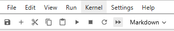

# Admission Analysis for Ukrainian Universities (2020–2024)

## **Project Overview**

The goal of the project is to investigate **trends** in higher education in Ukraine, to determine **the impact February 24** had on Ukrainian education.
Issues of distribution by regions, specialties, and fields of knowledge have been studied.

## **Dataset** (data.tar.gz)

### 1) `tender_offers.csv`

- **Competitive Offers (2020–2024):** Includes specialties, regions, industries, number of applications, universities, and additional details.

### 2) `statistics.csv`

- **Entrant Data (2020–2022):** Provides statistics on applications per competitive offer, average admission priorities, scores, state order volume, budget, and contract data.

### 3) `regions.json`

- Information by regions of Ukraine: the name of the region, its code

### 4) `universities.json`

- Contains information on educational institutions of Ukraine:
name, code, list of available years, region code

### 5) `Ukraine-regions.json`

- Map of Ukraine in geojson format for visualization

### 6) `regions_to_part_of_Ukraine.json`

- Contains information about the affiliation of each region to a certain region of Ukraine (West, East, South, Center)

### 7) `latin_to_cyrillic_region_names.json`

- Contain information about the correspondence of the name of the region in Latin ([from Ukraine-regions.json](#5-ukraine-regionsjson)) to the name in Cyrillic

---

## Basic Requirements

- [**Python**](https://www.python.org/downloads/): Version 3.10 or later is recommended.

## Installation

1. **Clone the repository:**

   ```bash
   git clone https://github.com/velosypedno/university-admissions-analysis.git
   cd university-admissions-analysis
   ```

2. **Extract the archive:**

    ```bash
    tar -xzvf data.tar.gz -C .
    ```

3. **Create python venv:**

    ```bash
    python3 -m venv venv
    source venv/bin/activate
    ```

4. **Install dependencies:**

    ```bash
    pip install -r requirements.txt
    ```

5. **Run the analysis:**

    ```bash
    jupyter notebook
    ```

6. **Navigate to the Jupyter Notebook interface in your browser:**  
*After running the command jupyter notebook, a browser window or tab will open. If it doesn’t, copy the URL shown in the terminal (it starts with http://localhost) and paste it into your browser.*

7. **Open the notebook file:**  
*In the Jupyter interface, locate and click on the analysis.ipynb file to open it.*

8. **Execute the notebook:**  
